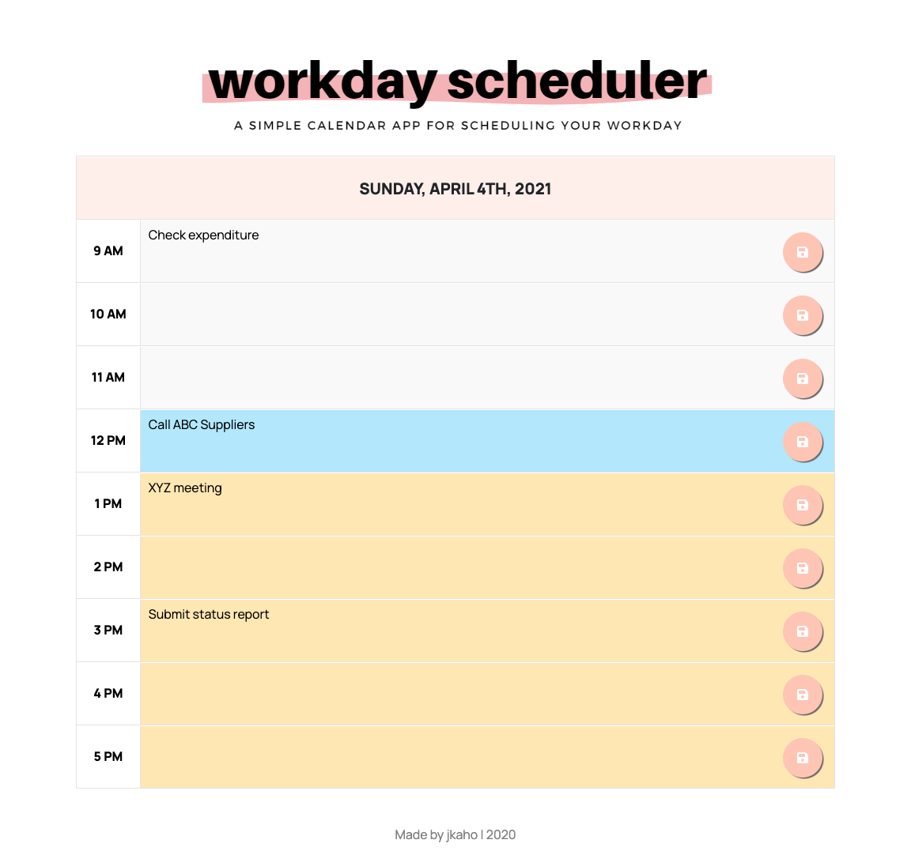

# Work Day Scheduler

## Description 

This web application is a simple daily scheduler designed to help people organise their work days.   Each time-block is colour-coded according to whether the time is in the past (grey), present (red), or future (green). Users can save events by inputting text in a time-block and then clicking the save button. Likewise, events can be removed by deleting text and then clicking the save button.  

## Screenshot

This is a screenshot of the deployed application.

## Link

[Link to deployed application](https://jkaho.github.io/work-day-scheduler/)
